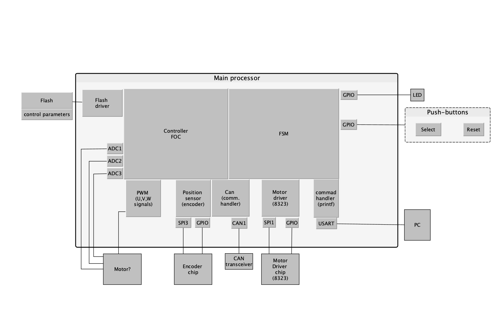

# motor_control
This project is based on https://github.com/bgkatz/motorcontrol

## Getting started

- Clone the repository
- Import STM32 project and build it
- Flash device and try it out

## Description

### CAN communication module

The CAN communication module, used for motor control communication, performs the following tasks:
- **Initialization**:
    - Initializes the interface with specific parameters like prescaler, synchronization jump width, and time segments.
    - Configures the receive message structure with filter settings for incoming messages.

- **Transmitting data about the motor controller's position, velocity, and current**:
    - Initializes the transmit message structure with parameters like data length code (DLC), identifier type, remote transmission request (RTR) type, and recipient ID.
    - Packs data into a reply packet by converting the data from floating-point format to the transmit data format.

- **Receiving data such as motor control commands (position, velocity) and control parameters (proportional gain (kp), derivative gain (kd), and feed-forward torque)**:
    - Unpacks received command packets by extracting the data.
    - Converts these values from the received format to floating-point for further processing.

### Serial communication module

This module provides functionality for the serial communication:

- **Initialization**: 
    - Initialize USART peripheral with specific settings, such as a baud rate of 9600, word length of 8 bits, stop bits of 1, no parity, no hardware flow control, and an oversampling ratio of 16. 
    - Enable the reception interrupt
- **Standard Library Function**: 
    - Implement the `putchar` function from the standard library. This function allows redirecting `printf` statements to the USART interface.
