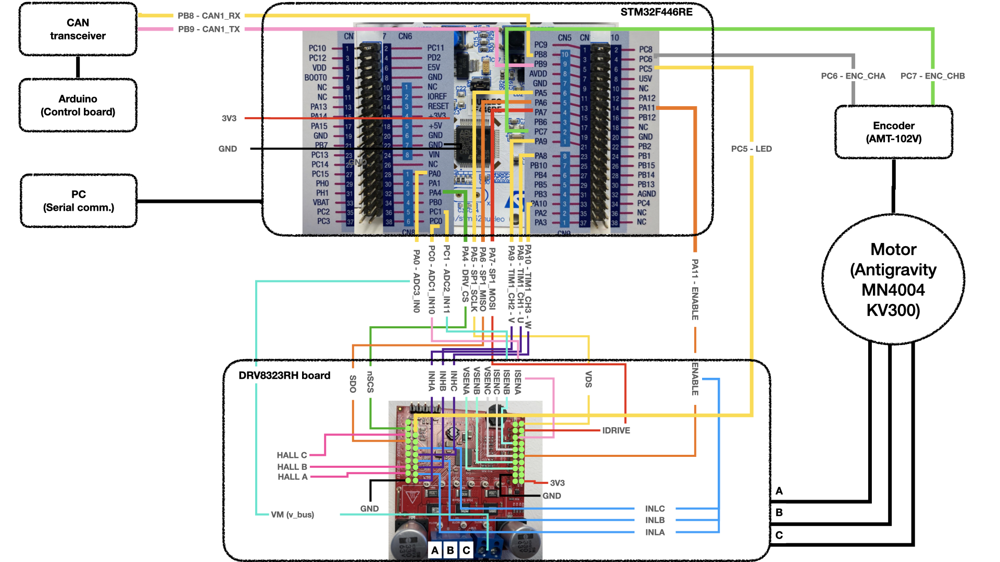

# Motivation
The main motivation behind this embedded project is to explore the functionalities and capabilities of the MiniCheetah motor controller. We aim to see how it could be adapted for our Dodo robot in the future. Our focus is on understanding this controller in detail. To do this, we have set up a system based on the motor control implementation available at https://github.com/bgkatz/motorcontrol. The primary goal is to thoroughly document this implementation, making it easier for future teams to adapt it for the Dodo robot.

[Video demonstation](https://gitlab.lrz.de/dodo/motor_control/-/blob/main/Image%20%26%20Video/Motor%20mode.mp4)

# System overview

The diagrams that follow depict the software architecture and the implementation of the system. For an extended documentation, refer to ...

## System Architecture

## Finite State Machine

## Sequence diagram for motor control

## FOC module

